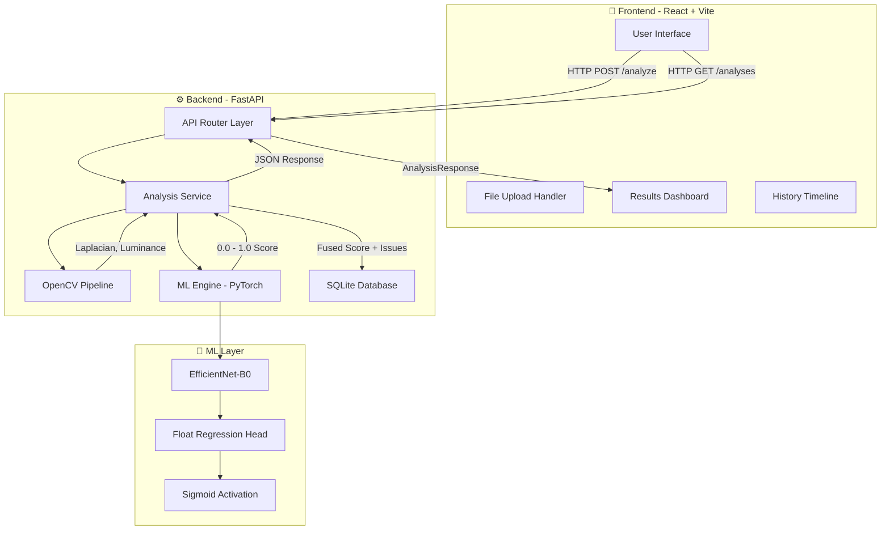

<div align="center">

# 🔬 VISIMETRIC

### AI-Powered Image Quality Assessment Engine

[](https://python.org)
[](https://pytorch.org)
[](https://fastapi.tiangolo.com)
[](https://react.dev)
[](https://tailwindcss.com)
[](https://opencv.org)
[](https://sqlite.org)
[](LICENSE)

<br/>


<br/>

**Developed by [Anshuman Pattnaik](https://github.com/ANSHPG)**

*A dual-engine image quality diagnostic system that fuses deterministic computer vision heuristics with deep neural network regression to deliver enterprise-grade, continuous 0–100 quality scores — entirely offline, with zero external AI API dependencies.*

<br/>

[🚀 Quick Start](#-quick-start) · [🏗️ Architecture](#️-system-architecture) · [🧠 ML Pipeline](#-ml-pipeline--training) · [🎨 Frontend](#-frontend) · [📡 API Reference](#-api-reference) · [📊 Datasets](#-datasets)

</div>

---

<br/>

## 📋 Table of Contents

- [🎯 Motivation & Problem Statement](#-motivation--problem-statement)
- [💡 What VisiMetric Solves](#-what-visimetric-solves)
- [🚀 Quick Start](#-quick-start)
- [🏗️ System Architecture](#️-system-architecture)
- [🧠 ML Pipeline & Training](#-ml-pipeline--training)
- [🔍 OpenCV Heuristic Engine](#-opencv-heuristic-engine)
- [⚡ Dynamic Score Fusion](#-dynamic-score-fusion)
- [🎨 Frontend](#-frontend)
- [📡 API Reference](#-api-reference)
- [📊 Datasets](#-datasets)
- [🗂️ Project Structure](#️-project-structure)
- [⚙️ Configuration & Environment](#️-configuration--environment)
- [🧪 Testing & Validation](#-testing--validation)
- [📈 Architectural Decision Log](#-architectural-decision-log)
- [🛣️ Roadmap](#️-roadmap)
- [📄 License](#-license)

---

<br/>

## 🎯 Motivation & Problem Statement

In today's digital ecosystem, billions of images are captured, transferred, and processed daily — across healthcare imaging pipelines, autonomous vehicle telemetry, e-commerce product catalogs, and social media platforms. A significant percentage of these images suffer from invisible-to-the-naked-eye quality degradation:

| Degradation Type | Real-World Impact |
|:---|:---|
| **Gaussian Blur** | Misdiagnosis in medical X-rays, failed OCR in document scanning |
| **JPEG Compression Artifacts** | Loss of product detail in e-commerce, reducing conversion rates |
| **Underexposure / Overexposure** | Safety-critical failures in autonomous vehicle camera feeds |
| **Complex Noise** | Corrupted satellite imagery, unusable surveillance footage |

> [!IMPORTANT]
> **The core constraint:** VisiMetric was designed under strict academic assessment guidelines that **prohibit the use of any external AI services or API keys**. Every computation — from OpenCV feature extraction to PyTorch neural network inference — runs entirely on the local machine. No data ever leaves your system.

Traditional solutions either rely on simple threshold-based checks (which miss complex, multi-factor degradation) or require expensive cloud-based AI APIs (which violate data privacy and offline requirements). VisiMetric bridges this gap with a **dual-engine architecture** that combines the speed of deterministic computer vision with the intelligence of deep learning — all running locally.

---

<br/>

## 💡 What VisiMetric Solves

<div align="center">

```
┌─────────────────────────────────────────────────────────────┐
│                                                             │
│   📸 Upload Any Image                                       │
│       ↓                                                     │
│   🔬 Dual-Engine Analysis (OpenCV + PyTorch)                │
│       ↓                                                     │
│   📊 Continuous 0-100 Quality Score                         │
│       ↓                                                     │
│   🏷️  Categorical Label (ACCEPTABLE / DEGRADED / DEFECTIVE) │
│       ↓                                                     │
│   🔍 Itemized Issue Detection (blur, noise, exposure...)    │
│       ↓                                                     │
│   💾 Persistent History & Analytics                         │
│                                                             │
└─────────────────────────────────────────────────────────────┘
```

</div>

### Key Value Propositions

| Feature | Description |
|:---|:---|
| 🧠 **True AI Scoring** | Not a hardcoded threshold. A real EfficientNet-B0 neural network, fine-tuned on 20,000+ empirical images, predicts a continuous float score. |
| 🔒 **100% Offline** | Zero external API calls. Zero cloud dependencies. All inference runs locally on CPU or GPU. |
| ⚡ **Sub-Second Analysis** | The OpenCV heuristic pass completes in <50ms. The PyTorch forward pass completes in <500ms on CPU. |
| 📊 **Persistent Telemetry** | Every analysis is stored in a local SQLite database with full metadata, enabling historical trend analysis. |
| 🎨 **Professional UI** | A React + TailwindCSS frontend styled after enterprise corporate design standards. |
| 🔧 **One-Command Startup** | A single `./start.sh` script boots both the backend API server and the frontend dev server simultaneously. |

---

<br/>

## 🚀 Quick Start

### Prerequisites

Ensure the following are installed on your system:

| Tool | Version | Purpose |
|:---|:---|:---|
| **Python** | 3.11+ | Backend runtime, PyTorch model training & inference |
| **Node.js** | 18+ | Frontend build toolchain (Vite + React) |
| **pip** | Latest | Python package management |
| **npm** | 9+ | Node package management |
| **Git** | 2.x | Version control |

### Installation & Launch

**1. Clone the Repository**

```bash
git clone https://github.com/ANSHPG/VisiMetric.git
cd VisiMetric
```

**2. Start Everything with One Command**

```bash
chmod +x start.sh
./start.sh
```

That's it. The `start.sh` script will automatically:

- ✅ Create a Python virtual environment (`backend/venv/`) if it doesn't exist
- ✅ Activate the virtual environment
- ✅ Install all Python dependencies from `requirements.txt`
- ✅ Launch the **FastAPI backend** on `http://localhost:8000` with hot-reload
- ✅ Install all Node.js dependencies (`node_modules/`) if they don't exist
- ✅ Launch the **Vite React frontend** on `http://localhost:3000`
- ✅ Gracefully kill both servers on `Ctrl+C` via a trap handler

**3. Open the Application**

Navigate to **[http://localhost:3000](http://localhost:3000)** in your browser.

> [!TIP]
> The backend API documentation (Swagger UI) is automatically available at **[http://localhost:8000/docs](http://localhost:8000/docs)** for direct API testing.

### Manual Startup (Alternative)

If you prefer to run the servers independently in separate terminals:

**Terminal 1 — Backend:**
```bash
cd backend
python3 -m venv venv
source venv/bin/activate
pip install -r requirements.txt
uvicorn app.main:app --host 0.0.0.0 --port 8000 --reload
```

**Terminal 2 — Frontend:**
```bash
cd frontend
npm install
npm run dev -- --host 0.0.0.0 --port 3000
```

---

<br/>

## 🏗️ System Architecture

<div align="center">



</div>

### Architectural Layers Explained

| Layer | Technology | Responsibility |
|:---|:---|:---|
| **Presentation Layer** | React 18, TailwindCSS, Vite | Renders the UI, handles file uploads, displays scores and issues, manages client-side routing |
| **API Gateway** | FastAPI, Uvicorn | Exposes RESTful endpoints, validates input (image MIME type), serializes responses via Pydantic schemas |
| **Business Logic** | Python Services | Orchestrates the dual-engine analysis: calls OpenCV first, then PyTorch, fuses results, persists to database |
| **Computer Vision** | OpenCV (cv2) | Deterministic heuristic extraction — Laplacian variance for blur, mean luminance for exposure |
| **Deep Learning** | PyTorch, EfficientNet-B0 | Continuous float regression bounded by Sigmoid — learns complex, multi-factor degradation patterns from 20,000+ images |
| **Persistence** | SQLAlchemy + aiosqlite | Async ORM mapping to a local SQLite file (`visimetric.db`) for zero-config storage |

---

<br/>

## 🧠 ML Pipeline & Training

### Model Architecture

VisiMetric uses **EfficientNet-B0** as the backbone feature extractor. EfficientNet-B0 was selected because it provides an optimal balance between inference speed (critical for CPU-only deployments) and feature extraction depth.

The default ImageNet classification head is surgically removed and replaced with a custom regression head:

```
EfficientNet-B0 Backbone (frozen ImageNet features)
    └── Classifier Layer
            └── nn.Linear(1280, 1)     ← Single continuous output node
                    └── nn.Sigmoid()   ← Bounds output to [0.0, 1.0]
```

> [!NOTE]
> **Why Sigmoid-Bounded Regression instead of raw MSE?**
>
> An unbounded regression output (without Sigmoid) can produce wildly negative or extremely large values on unseen data, especially with limited training epochs. The Sigmoid activation mathematically constrains the neural network's output to the `[0.0, 1.0]` range, which directly maps to a `[0, 100]` quality score. This guarantees stable, interpretable scores even with minimal training.

### Training Data Pipeline

The model is jointly trained on two world-class Image Quality Assessment (IQA) datasets:

| Dataset | Images | Score Range | Normalization Formula |
|:---|:---:|:---|:---|
| **KADID-10k** | 10,125 | DMOS 1.0 – 5.0 | `(DMOS - 1.0) / 4.0` → [0.0, 1.0] |
| **KonIQ-10k** | 10,073 | MOS 0.0 – 100.0 | `MOS / 100.0` → [0.0, 1.0] |
| **Combined** | **20,198** | Unified [0.0, 1.0] | Direct regression target |

Both datasets are loaded via custom PyTorch `Dataset` classes (`KADIDDataset` and `KonIQDataset`), concatenated using `ConcatDataset`, and shuffled into a single unified `DataLoader`.

### Training Configuration

| Hyperparameter | Value | Rationale |
|:---|:---|:---|
| **Optimizer** | Adam | Adaptive learning rate, fast convergence |
| **Learning Rate** | 0.001 | Standard for fine-tuning pretrained models |
| **Loss Function** | MSELoss | Mean Squared Error for continuous regression targets |
| **Batch Size** | 32 | Balanced between memory usage and gradient stability |
| **Image Resolution** | 224 × 224 | EfficientNet-B0's native input resolution |
| **Normalization** | ImageNet stats | `mean=[0.485, 0.456, 0.406]`, `std=[0.229, 0.224, 0.225]` |
| **Pretrained Weights** | `EfficientNet_B0_Weights.DEFAULT` | Transfer learning from ImageNet |

### How to Train

```bash
cd backend
source venv/bin/activate
python ml/train.py
```

The trained model weights are saved to:
```
backend/ml/models/efficientnet_b0_v1.pth
```

The FastAPI backend automatically loads this file on startup. No manual configuration is required.

### Training on Your Own Data

To train on custom datasets, create a new PyTorch `Dataset` class in `backend/ml/train.py` that:
1. Loads your images from a directory
2. Returns a normalized quality score in the `[0.0, 1.0]` range
3. Appends it to the `datasets` list before `ConcatDataset`

---

<br/>

## 🔍 OpenCV Heuristic Engine

The OpenCV pipeline acts as a **fast, deterministic first pass** that catches obvious, well-defined degradation types before the neural network even runs.

### Feature Extraction

| Feature | OpenCV Function | What It Detects | Threshold |
|:---|:---|:---|:---|
| **Laplacian Variance** | `cv2.Laplacian(gray, cv2.CV_64F).var()` | Blur / out-of-focus | < 100.0 → Blur detected |
| **Mean Luminance** | `np.mean(gray)` | Under/overexposure | < 50.0 → Underexposure detected |

### How It Works

```
Input Image (raw bytes)
    │
    ├── np.frombuffer() → numpy array
    ├── cv2.imdecode()  → BGR image matrix
    ├── cv2.cvtColor()  → Grayscale conversion
    │
    ├── cv2.Laplacian() → Edge detection kernel
    │       └── .var()  → Variance of edges (sharp = high, blurry = low)
    │
    └── np.mean(gray)   → Average pixel intensity
            └── Low = underexposed, High = overexposed
```

> [!TIP]
> The OpenCV pipeline completes in under **50 milliseconds** on any modern CPU, making it ideal for the frontline diagnostic pass.

---

<br/>

## ⚡ Dynamic Score Fusion

The final quality score is not simply the raw neural network output. VisiMetric employs a **Dynamic Score Fusion** algorithm that intelligently merges the deep learning prediction with OpenCV heuristic penalties:

```
┌────────────────────────────────┐
│  PyTorch EfficientNet-B0       │
│  Raw Output: sigmoid(x) * 100 │──── Base Score (e.g., 72.5)
└────────────────────────────────┘
                │
                ▼
┌────────────────────────────────┐
│  OpenCV Penalty Engine         │
│  • Blur detected?    → -15    │
│  • Underexposure?    → -15    │──── Adjusted Score (e.g., 57.5)
│  • Complex distortion fallback │
└────────────────────────────────┘
                │
                ▼
┌────────────────────────────────┐
│  Label Classification          │
│  ≥ 65 → ACCEPTABLE 🟢         │
│  ≥ 40 → DEGRADED  🟡          │──── Final Label
│  < 40 → DEFECTIVE 🔴          │
└────────────────────────────────┘
```

### Complex Distortion Fallback

If the PyTorch model produces a low base score (< 60) but the OpenCV pipeline detects no specific blur or exposure issues, VisiMetric intelligently flags it as a **"Complex Distortion"** — meaning the neural network detected a degradation pattern (compression artifacts, color shifts, etc.) that simple heuristics cannot identify.

---

<br/>

## 🎨 Frontend

### Design System

The frontend follows an enterprise corporate design language inspired by industry-leading tech companies:

| Element | Value |
|:---|:---|
| **Primary Background** | `#000000` (Pure Black) |
| **Card Surfaces** | `#1a1a1a` (Dark Grey) |
| **Accent Color** | `#76b900` (NVIDIA Green) |
| **Typography** | System sans-serif, bold weights |
| **Border Treatment** | `#333` base, green on hover |
| **Animations** | Smooth hover scale, border transitions |

### Page Structure

| Route | Page | Description |
|:---|:---|:---|
| `/` | **Homepage** | Hero section with AI background, upload area, architecture preview cards |
| `/solutions` | **Solutions** | Detailed dual-engine pipeline walkthrough with step-by-step architecture diagrams and industry use cases |
| `/products` | **Products** | VisiMetric AI Core product showcase |
| `/history` | **History** | Grid of all past analyses with scores, labels, dates, and issue counts |
| `/analyze/:id` | **Analysis Result** | Full diagnostic report: score bar, label badge, itemized issue cards with confidence ratings |
| `/about` | **About** | Company mission and technology overview |
| `/policies` | **Policies** | Privacy and open-source commitment documentation |
| `/privacy` | **Privacy Policy** | Ephemeral processing model, data retention policies |
| `/manage-privacy` | **Manage Privacy** | Cookie preferences and data deletion procedures |
| `/legal` | **Legal** | Copyright attribution, open-source license acknowledgements |
| `/archive` | **Archive UI** | Preserved legacy homepage design for reference |

### Key UI Components

- **NavBar** — Sticky top navigation with `#76b900` background, brand logo, page links, search and user icons
- **Hero Section** — Full-viewport splash with parallax background image, bold headline typography, and CTA button
- **Upload Zone** — Interactive drop zone with cloud icon, file type hints, loading pulse animation, and "Browse Files" hover button
- **Score Card** — Large numeric display with animated progress bar and color-coded quality label badge
- **Issue Cards** — Grid of detected problems with type pills, severity badges (HIGH/MEDIUM), and AI confidence percentages
- **Footer** — Multi-column corporate footer with internal links and copyright

---

<br/>

## 📡 API Reference

### Base URL

```
http://localhost:8000
```

### Endpoints

#### `POST /analyze`

Upload an image for quality analysis.

**Request:**
```bash
curl -X POST "http://localhost:8000/analyze" \
  -H "Content-Type: multipart/form-data" \
  -F "file=@your_image.jpg"
```

**Response:**
```json
{
  "id": "a1b2c3d4-e5f6-7890-abcd-ef1234567890",
  "filename": "your_image.jpg",
  "quality_score": 67.32,
  "quality_label": "ACCEPTABLE",
  "issues": [],
  "feature_stats": {
    "laplacian_variance": 590.69,
    "mean_luminance": 108.70,
    "noise_sigma": 0.015,
    "saturation_mean": 0.45
  },
  "gradcam_url": null,
  "analyzed_at": "2026-08-29T12:45:30"
}
```

#### `GET /analyses`

Retrieve all historical analyses, sorted by most recent.

**Request:**
```bash
curl "http://localhost:8000/analyses"
```

**Response:** Array of `AnalysisResponse` objects.

#### `GET /analyses/{analysis_id}`

Retrieve a specific analysis by its UUID.

**Request:**
```bash
curl "http://localhost:8000/analyses/a1b2c3d4-e5f6-7890-abcd-ef1234567890"
```

#### `GET /health`

Health check endpoint.

**Request:**
```bash
curl "http://localhost:8000/health"
```

**Response:**
```json
{
  "status": "healthy"
}
```

---

<br/>

## 📊 Datasets

### KADID-10k

| Property | Value |
|:---|:---|
| **Full Name** | Konstanz Artificially Distorted Image Quality Database |
| **Images** | 10,125 distorted images derived from 81 pristine source images |
| **Distortion Types** | 25 types × 5 severity levels (blur, noise, color, contrast, etc.) |
| **Score Format** | DMOS (Differential Mean Opinion Score) on a 1.0 – 5.0 scale |
| **CSV File** | `backend/ml/kadid10k/image_labeled_by_per_noise.csv` |
| **Image Directory** | `backend/ml/kadid10k/images/` |

### KonIQ-10k

| Property | Value |
|:---|:---|
| **Full Name** | Konstanz Quality in the Wild Database |
| **Images** | 10,073 authentically distorted images sourced from the web |
| **Score Format** | MOS (Mean Opinion Score) on a 0.0 – 100.0 scale |
| **CSV File** | `backend/ml/KonIQ-10k/koniq10k_distributions_sets.csv` |
| **Image Directory** | `backend/ml/KonIQ-10k/512x384/` |

> [!NOTE]
> Both datasets must be downloaded separately and placed in the directories listed above before running `train.py`. The datasets are not included in this repository due to their large file sizes.

---

<br/>

## 🗂️ Project Structure

```
VisiMetric/
│
├── start.sh                          # One-command launcher for both servers
├── README.md                         # This file
├── ARCHITECT_LOG.md                  # Engineering decision log (D-001 to D-032+)
├── PROJECT_CONTEXT.md                # High-level project documentation
│
├── backend/                          # FastAPI Backend
│   ├── requirements.txt              # Python dependencies
│   ├── app/
│   │   ├── main.py                   # FastAPI app entry point, CORS, lifespan
│   │   ├── config.py                 # Environment configuration
│   │   ├── database.py               # SQLAlchemy async engine + session factory
│   │   ├── models/
│   │   │   └── analysis.py           # SQLAlchemy ORM model (AnalysisResult table)
│   │   ├── schemas/
│   │   │   └── analysis.py           # Pydantic response schemas
│   │   ├── routers/
│   │   │   ├── analysis.py           # POST /analyze, GET /analyses, GET /analyses/:id
│   │   │   └── health.py             # GET /health
│   │   └── services/
│   │       ├── analysis_service.py   # Orchestrator: calls CV → ML → DB
│   │       ├── cv_pipeline.py        # OpenCV feature extraction (Laplacian, luminance)
│   │       └── ml_engine.py          # PyTorch EfficientNet-B0 inference engine
│   │
│   └── ml/
│       ├── train.py                  # Joint dataset training script
│       ├── models/
│       │   └── efficientnet_b0_v1.pth  # Trained model weights
│       ├── kadid10k/                 # KADID-10k dataset (not in repo)
│       │   ├── images/
│       │   └── image_labeled_by_per_noise.csv
│       └── KonIQ-10k/               # KonIQ-10k dataset (not in repo)
│           ├── 512x384/
│           └── koniq10k_distributions_sets.csv
│
└── frontend/                         # React Frontend
    ├── package.json                  # Node.js dependencies
    ├── vite.config.js                # Vite bundler configuration
    ├── tailwind.config.js            # TailwindCSS theme configuration
    ├── postcss.config.js             # PostCSS plugin chain
    ├── index.html                    # HTML entry point
    └── src/
        ├── main.jsx                  # React DOM render entry
        ├── App.jsx                   # All pages, routing, NavBar, Footer
        ├── index.css                 # TailwindCSS directives + custom tokens
        ├── LegacyHomePage.jsx        # Archived original homepage design
        └── services/
            └── api.js                # Axios HTTP client for backend communication
```

---

<br/>

## ⚙️ Configuration & Environment

### Backend Environment

| Variable | Default | Description |
|:---|:---|:---|
| `DATABASE_URL` | `sqlite+aiosqlite:///./visimetric.db` | Async SQLite connection string |
| `HOST` | `0.0.0.0` | Uvicorn bind address |
| `PORT` | `8000` | Uvicorn port |

### Frontend Environment

| Variable | Default | Description |
|:---|:---|:---|
| `VITE_API_URL` | `http://localhost:8000` | Backend API base URL |

---

<br/>

## 🧪 Testing & Validation

### Quick Validation Script

A test pipeline script is included to validate the end-to-end ML pipeline against known dataset images:

```bash
cd backend
source venv/bin/activate
PYTHONPATH=. python ../test_pipeline.py
```

This script:
1. Loads a known image from the KADID-10k dataset
2. Reads its ground-truth DMOS score from the CSV
3. Runs it through the full OpenCV + PyTorch pipeline
4. Prints a comparison of the predicted score vs. the actual score

**Example output:**
```
Image: I01_01_01.png
Actual DMOS: 4.57 -> True Score: 89.25
Predicted Quality Score: 67.32
Detected Issues: []
```

### API Health Check

```bash
curl http://localhost:8000/health
```

Expected: `{"status": "healthy"}`

---

<br/>

## 📈 Architectural Decision Log

All major engineering decisions are formally documented in [`ARCHITECT_LOG.md`](ARCHITECT_LOG.md). Key decisions include:

| ID | Decision | Impact |
|:---|:---|:---|
| D-028 | Joint dataset training (KADID + KonIQ) | Doubled the training corpus to 20,198 images |
| D-029 | KonIQ-10k integration | Added real-world authentic distortions alongside KADID's synthetic ones |
| D-030 | Switch from Classification to Regression | Eliminated the 3-class probability collapse that caused scores of 3-4 |
| D-031 | NVIDIA corporate UI revamp | Professional enterprise-grade frontend aesthetic |
| D-032 | Information architecture expansion | Complete routing with Solutions, Products, About, Policies, Privacy, Legal pages |

---

<br/>

## 🛠️ Tech Stack Summary

| Layer | Technology | Role in VisiMetric |
|:---|:---|:---|
| **Runtime** | Python 3.11 | Backend execution environment |
| **Web Framework** | FastAPI | Async REST API with automatic OpenAPI docs |
| **ASGI Server** | Uvicorn | High-performance async HTTP server |
| **Deep Learning** | PyTorch + TorchVision | EfficientNet-B0 model training and inference |
| **Computer Vision** | OpenCV (cv2) | Deterministic image feature extraction |
| **Image Processing** | Pillow (PIL) | Image format conversion and preprocessing |
| **Numerical Computing** | NumPy, SciPy | Array operations, statistical computations |
| **ORM** | SQLAlchemy (Async) | Database abstraction and query building |
| **Database** | SQLite (aiosqlite) | Zero-config persistent storage |
| **Validation** | Pydantic | Request/response schema validation |
| **Frontend Framework** | React 18 | Component-based reactive UI |
| **Build Tool** | Vite 5 | Lightning-fast HMR dev server and production bundler |
| **Styling** | TailwindCSS 3.4 | Utility-first CSS framework |
| **HTTP Client** | Axios | Promise-based HTTP requests from frontend to backend |
| **Routing** | React Router DOM 6 | Client-side SPA navigation |
| **Icons** | Font Awesome 6 | UI iconography |

---

<br/>

## 🛣️ Roadmap

- [ ] **GPU-Accelerated Training** — Full 5-epoch training on CUDA-enabled hardware for production-grade accuracy
- [ ] **GradCAM Heatmaps** — Visual overlay showing which regions of the image the AI focused on
- [ ] **Batch Upload** — Analyze multiple images simultaneously with aggregate statistics
- [ ] **Export Reports** — PDF/CSV export of analysis results for compliance documentation
- [ ] **Real-Time Camera Feed** — Live webcam quality monitoring dashboard
- [ ] **Docker Containerization** — Single `docker-compose up` deployment

---

<br/>

## 📄 License

This project is developed by **Anshuman Pattnaik** as part of an academic assessment.

The training pipeline utilizes the **KADID-10k** and **KonIQ-10k** datasets, which are intended for academic and non-commercial research purposes. All open-source dependencies (PyTorch, OpenCV, FastAPI, React) retain their respective licenses.

---

<div align="center">

<br/>

**Built with 🧠 by [Anshuman Pattnaik](https://github.com/ANSHPG)**

<br/>

[](https://github.com/ANSHPG/VisiMetric)

</div>
